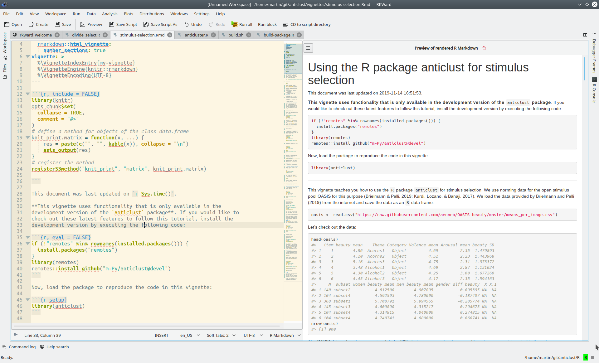

*This post was updated on October 28, 2020.*

After some time I returned to [KDE](https://kde.org/) (in particular, to 
[Kubuntu](https://kubuntu.org/)). I had always liked its style, but 
unfortunately I always had some problems with stability in previous versions. 
With version 19.10 -- and now the long term stable 20.04 -- everything is 
running smoothly. 

Why is Kubuntu good for writing in R Markdown? First, by default it ships the 
awesome text editor [Kate](https://kate-editor.org/) that has nice R Markdown 
syntax highlighting,[^atom] spell checking, and syntax highlighting for math 
equations. Second, KDE offers the powerful `R` IDE 
[RKward](https://rkward.kde.org) that includes Kate as its code editor. Even 
better, RKward can be used from any operating system, not just from Kubuntu or 
other Linux systems. I really encourage everyone to try it out, if just to see 
an alternative to RStudio once in a while. Moreover, while rkward has been 
around for a long time, its code base [is still being maintained and 
extended](https://invent.kde.org/education/rkward). As it uses Kate as its 
editor, it also profits freely whenever kate is improved.

[^atom]: In general, writing in R Markdown now seems to be much more 
comfortable than some years back. The [atom editor](https://atom.io/) 
also includes a nice mode for R Markdown documents. However, for now I 
prefer Kate and rkward.

As said, Kate should be included by default in the Kubuntu repository.
If you are using a different Ubuntu flavor, the following works:

```
$ sudo apt install kate
```

RKward can be installed using the standard Ubuntu repository:

```
$ sudo apt install rkward
```

Note that this version will be slightly outdated, and more recent 
versions are available through the launchpad project (see "Inofficial 
Ubuntu repositories" 
[here](https://rkward.kde.org/Binaries_and_Build_Scripts.html)).

[Building from source](https://rkward.kde.org/Building_RKWard_From_Source.html) 
is also easier than one may think (provided the required build tools are 
available -- that is actually the main problem). The most recent sources are 
available from https://invent.kde.org/education/rkward.

### Document preview

In the latest versions (v0.7.1 upwards) of RKward, it is possible to activate 
document preview for R Markdown documents. This is actually a nice 
advantage over RStudio. It will only preview html documents, but I think 
for the purpose of editing the writing this should be enough. I even 
heard that pdf preview is on the maybe-to-do list.

To activate the Preview mode, click the Preview button in the tool bar. 
If this button does not appear by default, go to `Settings -> Configure 
Toolbars -> mainToolBar <rkward_commandeditor>`. In this menu, drag 
`Preview` to `Current Actions`. Now, if you click `Preview` in the tool 
bar above the text editor, a html version of your R Markdown document 
will be rendered whenever you save your file. It looks like this:



### Setting hard line breaks in Kate

As discussed [here](05_setUpRMDemacs.html), I prefer hard line breaks as 
opposed to soft breaks. Any text editor I use for writing R Markdown 
should include functionality for hard line breaks. Fortunately, Kate 
(and hence, RKward) does. However, we first have to define a custom 
shortcut for this functionality. This is done via `Settings -> Configure 
Shortcuts -> Apply Word Wrap`. I use `Alt-Q` to insert hard line wraps, as
emacs does.

### Useful adjustments in rkward settings

Go to `Settings -> configure script editor`

- Prevent automcompletion to `[[·]]` when typing `$` by changing the option 
'Operator for access to members of list() and data.frame() objects'
- 'Keyboard navigation of completion items: Up/Down cursors'
- 'Tab key invokes code completion'

### Useful Kate features

- Focus the Terminal: `F4` (goes back as well)
- Recognizes git repositories as project, the developers even plan to 
integrate git better in Kate in the future (see 
[here](https://kate-editor.org/post/2019/2019-10-20-git-client-
integration/)). This feature is now also available in rkward, which is really 
awesome for package development.
- Set the column limit for hard line breaks: 
  `Settings -> Configure Kate -> Editing -> Wrap Words at`
- You can adjust Kate settings from within RKward as well

---

Last updated: `r Sys.Date()`
  
### <a href="index.html">Back to the front page</a>

&nbsp;
