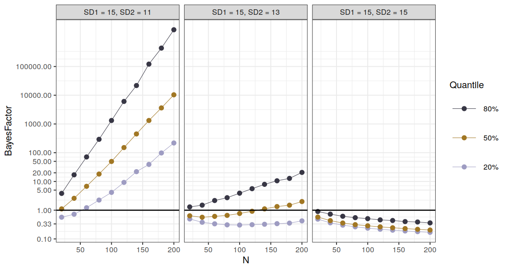
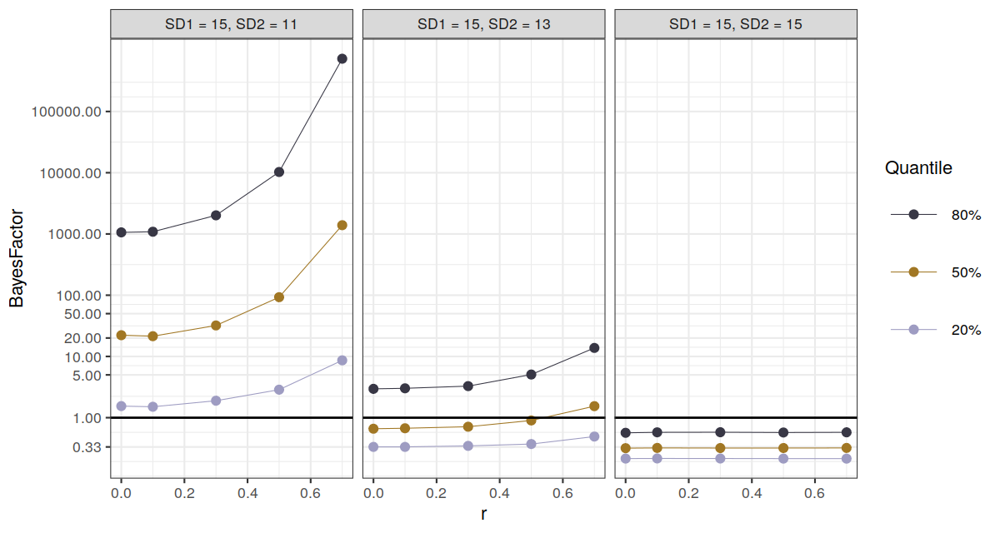

This post explores the properties of a [Bayes factors for the comparison 
of two dependent variances](12_BF_Dependent_SD.html) via simulation. To 
this end, I investigate whether the Bayes factors agree with a known 
"ground truth" that I induce in a computer simulation. The major benefit 
of simulation studies is that we can compare the output of a method to a 
known hypothetical state of nature. 

Because I investigate a Bayes factor comparing two dependent variances, 
I need a function to create bivariate normal data:

```{r}
# Generate bivariate normal data with specified correlation
#
# param n: how many data points
# param m1: the mean of the first variable
# param m2: the mean of the second variable
# param sd1: the standard deviation of the first variable
# param sd2: the standard deviation of the second variable
# param r: the »true« correlation between the two measures
# 
# return: the data set (two columns with random normal data generated 
#     via MASS::mvrnom)
paired_data <- function(n, m1, m2, sd1, sd2, r) {
  cor_matrix <- matrix(c(1, r, r, 1), ncol = 2)
  sds <- c(sd1, sd2)
  vars <- sds %*% t(sds)
  cov_matrix <- vars * cor_matrix
  MASS::mvrnorm(n, mu = c(m1, m2), Sigma = cov_matrix)
}
```

This function creates two columns of data and I can specify the true 
means, standard deviations and the true correlation between the 
measures. Note that this does not imply that each data set that is 
generated via using this function has these exact parameters: due to 
sampling error, that values observed in a sample will vary across 
simulation runs.

Next, I specify a function that generates data using `paired_data()` and
then calls computes the Bayes factor comparing the variances of the two
measures. 

```{r}

compare_correlated_variances <- function(X, n, m1, m2, sd1, sd2, r) {
  pairs <- paired_data(n, m1, m2, sd1, sd2, r)
  varBF::depvarBF(pairs[, 1], pairs[, 2])
}
```

The first function parameter `X` is somewhat a nuissance, but stay with 
me for a moment---I use it to call the function as many times as I want 
to in a single step.

The simulation principle following now is actually rather simple: I 
systematically vary relevant input parameters, such as 

- the "effect size" (i.e., how different are the variances)
- the sample size
- the correlation between the measures

In general, simulations are computationally demanding because there is a 
large combinatorial space that results from crossing all possible 
combinations of input parameters. Usually, we have to restrict 
ourselves. To repeat the process for just one possible combination of 
parameters, we can use the `lapply()` function to repeat the 
computations 100 times as follows: 

```{r}
# Generate 100 bivariate data sets and compute a Bayes factor each time:
BFs <- lapply(
  X = 1:100, 
  FUN = compare_correlated_variances,
  n = 100,
  m1 = 100,
  m2 = 100,
  sd1 = 15,
  sd2 = 10,
  r = .3
)
```

To print the output of the `lapply()` function in an understandable way, 
I define the following function that returns the quantiles of the Bayes 
factor across simulation runs:

```{r}
# Input `BFs` is a `list` of Bayes factors
BF_quantiles <- function(BFs) {
  BFs <- simplify2array(BFs, higher = FALSE)
  quants <- c(quantile(BFs, probs = seq(0.1, 0.9, 0.1)))
  quants <- format(
    quants, 
    scientific = FALSE, 
    digits = 2, 
    nsmall = 2,
    big.mark = ","
  )
  ret <- data.frame(quantile = names(quants), BayesFactor = quants)
  rownames(ret) <- NULL
  ret
}
```

Let's check out the quantiles:

```{r}
BF_quantiles(BFs)
```

What does this tell us? For example, only 20% of all observed Bayes 
factors that were smaller than `r BF_quantiles(BFs)$BayesFactor[2]`. 
Remember, the Bayes factor quantifies the degree to which the 
alternative hypothesis is favored over the null hypothesis. Therefore, 
more than 80% of all simulation runs (each representing a hypothetical 
study) indicate very strong evidence in favor of the hypothesis that the 
variances are different. This is good because this is with the "ground 
truth": we know that the "true" variances differ. 

Therefore, given 

- a standard deviation of 10 in one group and 15 in another group
- a sample size of 100
- a correlation between samples of $r = .3$

the Bayes factor will generally yield evidence that is consistent with 
the true state of the nature. Next we wish to find out whether this 
property holds for all sorts of different conditions.

In my simulation, I crossed the following conditions: 

- The correlation between the measures varied between 0.1, 0.3, 0.5 and 0.7
- The standard deviation of one measure varied between 11, 13 and 15
- $N$ varied between 20, 40, ..., 180 and 200

This resulted in 150 parameter combinations, for which I simulated 1,000 
data sets, respectively. This did not even take as long as one might 
expect, only ~ 5min. In total, I ended up with 150,000 Bayes factors.

Across all simulation runs, the true mean of both measures was always 
set to 100; the standard deviation of one measure was always set to 15. 
Therefore, I varied the effect size by adjusting the other standard 
deviation (between 11, 13 and 15). One condition was realized where the 
null hypothesis was true, i.e., when both standard deviations was 15. 
Note that some conceivable conditions were not realized: $N$ might be 
much larger than 200, and maybe adjusting the means also has an effect 
(but I don't think so). The code is available 
[here](./rmdsource/rsource/simulation_bf_var.R).

The results are displayed in the following plot: 

```{r, echo = FALSE}

```

In the plot, the three panels realize the three effect sizes under 
investigation; in the right panel, there is the null effect where 
both standard deviations / variances have the same value. In the left 
panel, there is the largest effect size. Data points illustrate Bayes 
factor quantiles. The y axis illustrates the Bayes factor and is given 
on a log scale because the Bayes factor quickly becomes huge for larger 
effects. The red dots indicate that for a given combination of 
$N$ and effect size (aggregated over the different correlation 
coefficients that are ignored in this plot), 20% of all observed Bayes
factors were smaller, i.e., 80% were larger. The black line illustrate 
the case of indifference: A Bayes factor of 1 neither favors the null 
nor the alternative.

Overall, the distribution of Bayes factors [looks as it 
should](06_BFSize.html). For a large effect, the effect size quickly 
increase as the sample size increases. A sample size of 100 is enough to 
ensure that more than 80% of all observed Bayes factors are larger than 
5, which is considerable evidence favoring the alternative hypothesis. 
When the null effect is true, the evidence favoring the null hypothesis 
increases with increasing $N$, which is good. However, finding evidence 
that favors the null often requires large $N$. In the current 
simulation, for $N = 100$, we barely miss the mark that 80% of all Bayes 
factors $BF01$ favor the null hypothesis by a factor of at least 3. This 
is no reason to worry as it is a general property of Bayes factors.

Out of interest, we may also plot the distribution of Bayes factors by
the correlation between the measures:

```{r, echo = FALSE}

```

This plot is interesting as well. As one might have expected, the size 
of the Bayes factors increases with increasing correlation (however, 
apparently this is not the case when the null hypothesis is true!). This 
is why using within-subject designs usually pays offs: the correlated 
nature of the data leads to more informative inferences, at least when
there is an effect.

## Limitations

In this post, I restricted the investigation of the Bayes factors to 
normal input data. Real data in psychological research is never truly 
normal, and in many cases not even approximately normal. There is some 
evidence that the Morgan-Pitman test that is the basis for the Bayes 
factor comparing dependent variances is particularly susceptible to 
deviations from normality, so exploring non-normal data should be done
in the future. However, [simulating correlated non-normal data is 
hard](https://psychometroscar.com/2019/10/16/how-to-simulate-correlated-log-normal-random-variables-the-right-way/).
Still, this is plans for the future. 

## Conclusions 

Based on the current simulations, I would conclude that the Bayes factor 
for the comparison of dependent variances works as one should expect. 
However, of course this simulation is not an exhaustive evalution, but 
it gives reason for hope.

---

Last updated: `r Sys.Date()`

### <a href="index.html">Back to the front page</a>

&nbsp;
