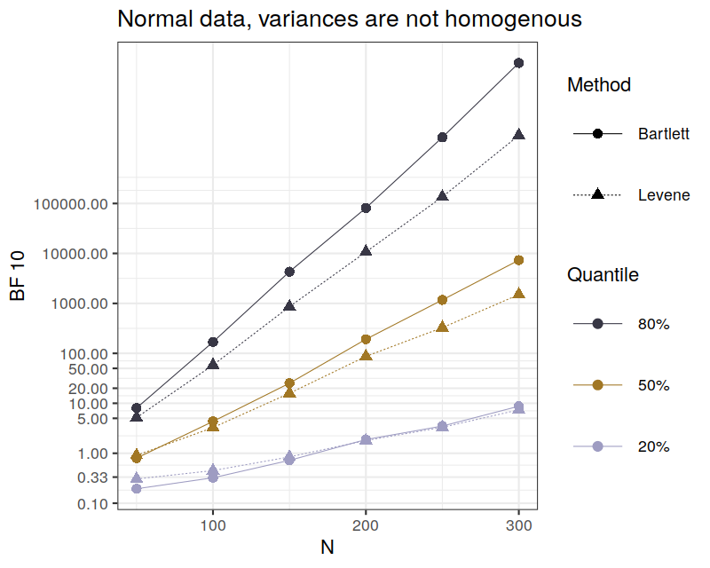
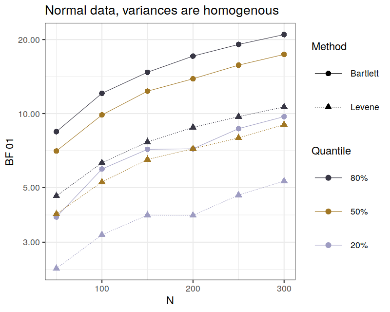
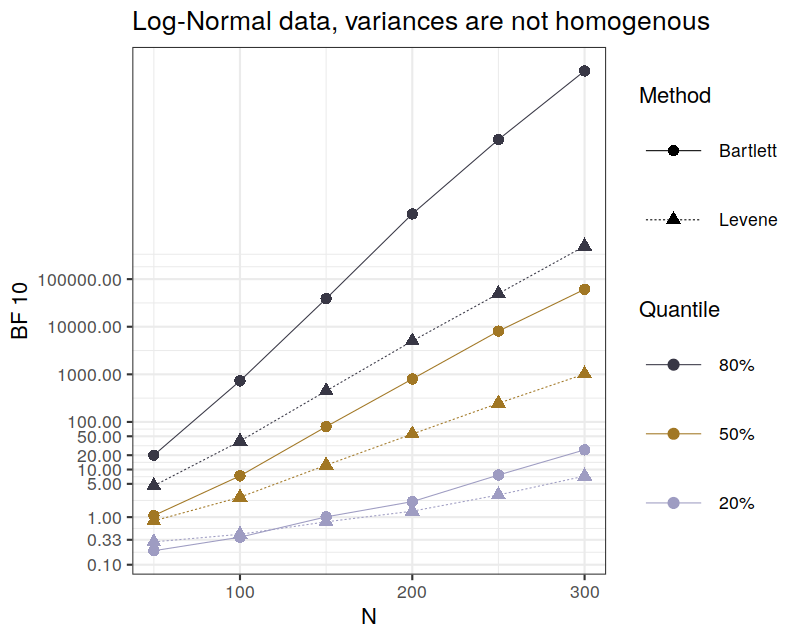
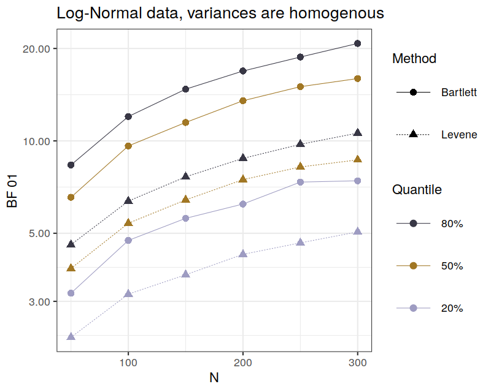

```{r, include = FALSE}

library(knitr)
knitr::opts_chunk$set(message=FALSE, warning = FALSE)
options(scipen = 999, digits = 2)

```

In an earlier post, I noted that [the Bartlett-Mulder and 
Levene-Anderson Bayes factors for the comparison of independent 
variances may yield different results](14_BFpack.html). In this post I 
explore this discrepancy a bit more systematically using Monte Carlo 
simulations. I show that the Bartlett-Mulder Bayes factor from the new 
`R` package 
[`BFpack`](https://cran.r-project.org/web/packages/BFpack/index.html) 
outperforms the Levene-Anderson Bayes factor across a variety of 
conditions.

## Preparing the simulation

First, I define a function that computes a Levene test, a Bartlett 
test, and the corresponding Bayes factors given two samples of 
numeric observations $x$ and $y$:

```{r}

# Function to compare variances from two independent groups
#
# param x: The first numeric vector, data points from one sample
# param y: The second numeric vector, data points from the other sample
# return: p values and Bayes factors for Bartlett and Levene test

compare_variances <- function(x, y) {
  nx <- length(x) 
  ny <- length(y)
  
  # Levene test
  lt <- car::leveneTest(
    y = c(x, y),
    group = factor(c(rep(1, nx), rep(2, ny)))
  )
  
  # Bartlett test 
  bt <- BFpack::bartlett_test(
    x = c(x, y),
    g = c(rep(1, nx), rep(2, ny))
  )
  
  # Bartlett-Mulder Bayes factor
  posteriors <- BFpack::BF(bt)$PHP_exploratory
  BFB <- posteriors[2] / posteriors[1]

  # Levene-Anderson Bayes factor
  BFL <- varBF::indepvarBF(x, y)
  
  # Output
  output <- c(
    P_Levene = lt[["Pr(>F)"]][1],
    P_Bartlett = bt$p.value,
    BF_Levene = BFL,
    BF_Bartlett = unname(BFB)
  )
  output
}
```

To show how it works, let's generate two vectors of normal data with 
different standard deviations and feed them into the function 
`compare_variances()`: 

```{r}
n_group <- 100
group1 <- rnorm(n_group, mean = 100, sd = 15)
group2 <- rnorm(n_group, mean = 100, sd = 20)

compare_variances(group1, group2)
```

As we can see, the Levene and Bartlett *p*-values and Bayes factors 
differ for the same data set.

Next, I define a function that can be used to repeat the simulation 
process while varying input parameters. The sample size per group 
(function argument `N`) and one of the two standard deviations (function 
argument `sd2`) vary between simulation runs; the parameter `nruns` 
defines the number of repetitions for each combination of sample size 
and standard deviation.

```{r}
# This function allows a multiple length vector `N` and `sd2` as input 
# for allowing to vary `N` and the effect size between simulation runs.
# The parameter `nruns` then refers to the simulation runs for each 
# combination of `N` and `sd2`!
simulate_variance_comparison <- function(nruns, N, sd2) {
  conditions <- expand.grid(N = N , sd2 = sd2)
  results <- list()
  for (i in 1:nrow(conditions)) {
    sim_runs <- lapply(
      X = 1:nruns,
      simulate_variance_comparison_,
      N = conditions$N[i],
      sd2 = conditions$sd2[i]
    )
    results[[i]] <- data.frame(t(simplify2array(sim_runs, higher = FALSE)))
    results[[i]]$N <- conditions$N[i]
    results[[i]]$sd2 <- conditions$sd2[i]
  }
  do.call(rbind, results)
}

# helper function; generates data and computes BF for a single simulation run
simulate_variance_comparison_ <- function(X, N, sd2) {
  group1 <- rnorm(N, mean = 100, sd = 15)
  group2 <- rnorm(N, mean = 100, sd = sd2)
  compare_variances(group1, group2)
}
```

## Simulation 1: Variances differ

Now, let's simulate 100 runs where the true standard deviations 
differ (15 versus 20):

```{r}
comparisons <- simulate_variance_comparison(
  nruns = 100, # number of simulation runs
  N = 100, # sample size per group
  sd2 = 20 # defines the "effect size", difference between SDs
)
```

Let's check out the simulation output (the first 6 cases):

```{r}
head(comparisons)
```

Whenever the *p*-values are small, the Bayes factors are large; 
moreover, the Bayes factors covary rather substantially: Whenever the 
Levene-Anderson Bayes factor is large, so is the Bartlett-Mulders Bayes 
factor. This is how it should be. Let's examine these relationships more 
formally by observing the correlations between Bayes factors and 
*p*-values:

```{r}
cor(
  log(comparisons[, c("P_Levene", "P_Bartlett", "BF_Levene", "BF_Bartlett")])
)
```

According to the correlation matrix, the Bayes factors agree with each 
other pretty well. Note that I correlated the log Bayes factors because 
Bayes factors can be so huge that we cannot find linear relationships 
with other variables.

Next, let's compare the magnitude of the Bayes factors under 
investigation. Is the Bartlett-Mulder Bayes factor generally larger? To 
find out, I compare the Bayes factor quantiles:

```{r}
data.frame(
  Levene_Anderson = quantile(comparisons$BF_Levene, probs = seq(0.1, 0.9, 0.1)),
  Bartlett_Mulder = quantile(comparisons$BF_Bartlett, probs = seq(0.1, 0.9, 0.1))
)
```

The median (50% quantile) Levene-Anderson Bayes factor is slightly 
smaller than the median Bartlett-Mulder Bayes factor. We also more often 
find very large Bartlett-Mulder Bayes factors. Hence, the 
Bartlett-Mulder Bayes factor has an advantage because it generally 
indicates stronger evidence in favor of the true hypothesis, i.e., the 
hypothesis that the variances differ. However, note that the difference 
between the Bayes factors is not huge; the input data is much more 
important, as shown by the strong correlation between the two Bayes 
factors.

## Simulation 2: Variances do not differ

Next, let's compare the two Bayes factors when the null hypothesis is 
true:

```{r}
comparisons <- simulate_variance_comparison(
  nruns = 100, 
  N = 100, 
  sd2 = 15 # sd1 is also 15, as we know - null effect!
)

# Display the results as quantiles:
data.frame(
  Levene_Anderson = quantile(1 / comparisons$BF_Levene, probs = seq(0.1, 0.9, 0.1)),
  Bartlett_Mulder = quantile(1 / comparisons$BF_Bartlett, probs = seq(0.1, 0.9, 0.1))
)

```

Here, I computed the Bayes factor $BF_{01}$---by dividing $1$ by the 
Bayes factor $BF_{10}$---representing the degree to which the data 
favors the null hypothesis over the alternative. Again, the 
Bartlett-Mulder Bayes factor are larger and hence convey stronger 
evidence in favor of the true null hypothesis. 

## Simulation 3: Variances differ -- more conditions

To generalize the results, I repeat the simulations from above but
include more conditions, i.e., I vary $N$ and the effect size between 
conditions. First, I again assume that the true variances are different.
Per condition, I simulate 1,000 runs, allowing for a rather precise 
comparison:

```{r, eval = FALSE}
comparisons <- simulate_variance_comparison(
  nruns = 1000, 
  N = seq(from = 50, to = 300, by = 50), 
  sd2 = c(18, 20, 22)
)
```

I plot the Bayes factor quantiles by $N$ and method. The code needed to 
reproduce all simulations and plots is available 
[here](./rmdsource/rsource/simulation_bf_var2.R). 

```{r, echo = FALSE}

```

It seems that across this variety of conditions, the Bartlett-Mulder 
Bayes factor tends to yield higher Bayes factors, which is good because 
the variances actually differ. However, note that the 20% quantile lines 
mostly overlap. What does this mean? The lines themselves indicate that 
80% of all observed Bayes factors were larger than the respective value. 
In a frequentist mindset, this value is important because we often 
expect that 80% of our studies should yield informative results (this 
does not sound good when I say it like this, right?). At ~ $N = 300$, 
80% of all Bayes factors seem to be larger than 5, which is more 
or less convincing evidence that the variances actually differ. Note 
that this threshold does not really differ between the two Bayes factors. 
Hence, studies will mostly be equally informative, regardless of the 
Bayes factor we compute (for the conditions that were realized in this 
simulation).

## Simulation 4: Variances do not differ -- more conditions

In a forth simulation, I assumed a null effect and varied $N$ between 
simulation runs using the following code: 

```{r, eval = FALSE}
comparisons <- simulate_variance_comparison(
  nruns = 1000, 
  N = seq(from = 50, to = 300, by = 50), 
  sd2 = c(15) # null effect
)
```

Hence, 1,000 simulation runs were conducted for various sample sizes.
The results are illustrated in the following plot:

```{r, echo = FALSE}

```

The $y$-axis displays the Bayes factor $BF_{01}$, meaning that larger 
values indicate more evidence in favor of the null hypothesis. The plot 
shows that the Bartlett-Mulder Bayes factor generally yields higher 
evidence in favor of the null hypothesis, arguably to a non-negligible 
degree.

## Log normal data

I repeated simulations 3 and 4 using log-normal instead of normal data. 
The following plots illustrate the results. 

```{r, echo = FALSE}

```

```{r, echo = FALSE}

```

The Bartlett-Mulder Bayes factor is favored even more for log-normal 
input data; it always conveys stronger evidence for the true 
hypothesis.

## Conclusions

The Bartlett-Mulder Bayes factor outperforms the Levene-Anderson Bayes 
factor across a variety of conditions: for small to medium large $N$, 
when the variances differ; when the variances are the same; for normal 
data and for log-normal data. This is an important observation. 
Apparently, the Bartlett-Mulder Bayes factor from the `BFpack` package 
is well suited to test for variance homogeneity in independent samples. 
Of course, it is always possible to cover more conditions in a 
simulation, such as other data distributions, more effect sizes, or 
larger $N$. 

---

Last updated: `r Sys.Date()`

### <a href="index.html">Back to the front page</a>

&nbsp;
