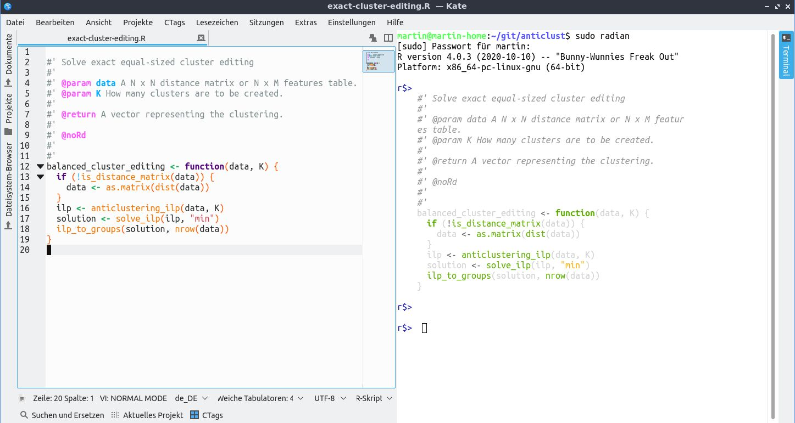

I like the [Kate editor](https://kate-editor.org/), so I write this post to list 
all of my settings to make it usable as a data science environment (for R / 
Python). This guide relies on the VI editing mode of Kate, which may not be for 
everyone (however, I am a VI noob myself). I explain some optimizations for 
writing in Kate (e.g., filling paragraphs) and how to submit code to the (R or 
Python) console. 



## General settings

These are my (non-data-science) related configurations. 

### Activate VI mode

- Activate VI mode in `Configure Kate -> Editing`
- Activates the feature that VI commands replace Kate commands

### Hard line breaks  

As I prefer hard versus soft linebreaks when writing, for example R Markdown 
documents, I need some functionality for hard line breaks. In my opinion, 
[emacs](https://www.gnu.org/software/emacs/) has the best option for hard line 
breaks with the [fill paragraph](https://www.emacswiki.org/emacs/FillParagraph) 
option. I have not seen this option in any other text editor so far. However, I 
found out how to emulate this functionality in Kate: 

- `Settings -> Configure Shortcuts -> Apply Word Wrap`. Use anything exotic, as 
you will mostly not use this short cut, I assume you use `CTRL-ALT-Q` 
- Add a new key binding for VI in `Configure Kate -> Editing -> VI editing` 
- In normal mode, add the following key binding: 
  * `<a-q>`: mz { j V } k \<c-a-q\> V \`z. This adds the fill paragraph 
option to `ALT-Q` key binding in VI normal mode
- In Insert mode (most importantly, I guess), use <esc> mz { j V } k <c-a-q> V 
\`z i. That is, wrap ESC and `i` around the command to leave and re-enter visual 
mode.
- `CTRL-ALT-Q` can still be used if just one line needs to be "broken"

### Fonts

1. Create a new scheme for fonts that can be adapted 
2. Change the font to Ubuntu Mono 14pt (so beautiful <3) 
3. Change the color in `Documentation -> Annotation` and `Comment Variable` 
to something more colorful (something that is easily recognized among 
grey comment font) 

### Konsole

Kate requires that the KDE terminal `konsole` is available. On non-KDE desktops 
this may need to be installed, on Ubuntu for example with 

```
$ sudo apt install konsole
```

Next, some configurations for the terminal. 

- Deactivate `Synchronize Terminal with Current Document` in the settings. This 
is crucial to prevent the terminal trying to `cd` to the directory of every 
document that is opened, which raises an erron when you are in the python or R 
console. 
- Move the terminal to the right of Kate (via right click on the terminal button below).
- Open the terminal, right click and choose `Edit current profile` to change the 
appearance of the terminal to your liking. In the terminal, we will start the R 
or python consoles, as explained below.

## Using Kate as Data Science IDE

In this section, I describe the functionalities of Kate making it useful as a 
Data Science environment.

### CTags

Activate CTags in Kate to efficiently browse and navigate through code. First, 
it has to be installed, on Ubuntu using:

```
$ sudo apt install exuberant-ctags
```

Activate the CTags plugin in Kate: Settings `Configure Kate -> Plugins ->` 
*Click the Ctags button*. 

Define key bindings for CTags: `Settings -> Configure Keyboard Shortcuts -> 
Action CTags`. I use `CTRL-Y` for jumping to a function definition, `CTRL-Q` to 
go back, and `CTRL-ALT-Q` to go to a declaration. Note that code needs to be 
processed by CTags in order to navigate through code. This can be done using the 
CTags button at the bottom via "indexing files". Remember to update the index 
when writing new code. 

By default, CTags does not include support for the R language, which can however 
can be added by the user. To enable R support, we can add the following lines to 
a file ".ctags" in the home directory (if it does not exist, create it):

```
--langdef=R
--langmap=r:.R.r
--regex-R=/^[ \t]*"?([.A-Za-z][.A-Za-z0-9_]*)"?[ \t]*(<-|=)[ \t]function/\1/f,Functions/
```

### Submit code to the console

For python, I use the [ipython konsole](https://ipython.org/), and for R, I use 
[radian](https://github.com/randy3k/radian). Then, we have an "intelligent" 
console, while the editor itself is still rather "dumb". For example, in RStudio 
or rkward the editor understands the R environment and may offer completion 
suggestions for function arguments. When using Kate, we do not have this 
convenience.

To submit code to the console via CRTL-Shift-C, add the following VI 
keybindings:

- normal mode:
  * `<s-c-c>`: `V } y <f4> <s-c-v> <cr> <f4> <esc> }`
- insert mode:
  * `<s-c-c>`: `<esc> V } y <f4> <s-c-v> <cr> <f4> <esc> } i`
- visual mode:
  * `<s-c-c>`: `y <f4> <s-c-v> <cr> <f4> <esc>`

This way, CTRL-Shift-C will execute either the current (or following) code block 
or, when in visual mode, the code selection.

To send the entire document to the console via CTRL-Shift-Z, add this 
keybinding: 

- `<s-c-z>`: mz ggVG y \<f4\> \<s-c-v\> \<cr\> \<f4\> \<esc\> \`z
  
### Problems with R / radian in the Kate terminal

In the current version of Kate that I use, the konsole terminal does not play 
entirely flawlessly with R or radian; it has to be started using `sudo radian` 
and then, the user R library is not found, meaning that depending on how the R 
packages were installed, these cannot be found when using R in Kate. I expect 
that this problem will vanish in future releases. For now, I had to add a 
`.radian_profile` file that adds my user R library to the search path 
`.libPaths()`.

### Improved syntax highlighting for R code

The standard syntax highlighting scheme for R code ist rather old. Use my 
improved syntax highlighting, instead, which for example includes syntax 
highlighting for [roxygen](https://roxygen2.r-lib.org/) documentation in R 
packages. Get the syntax highlighting file 
[here](https://invent.kde.org/mpapenberg/syntax-highlighting/-/raw/master/data/syntax/r.xml). and add it to 

```
~/.local/share/katepart5/syntax
```

or 

```
~/.local/share/org.kde.syntax-highlighting/syntax
```

Create these directories if they do not exist.

### Optimizing indentation

In this section I will describe how to optimally use indentation in Kate, as 
soon as I understand it.

---

Last updated: `r Sys.Date()`

### <a href="index.html">Back to the front page</a>

&nbsp;
